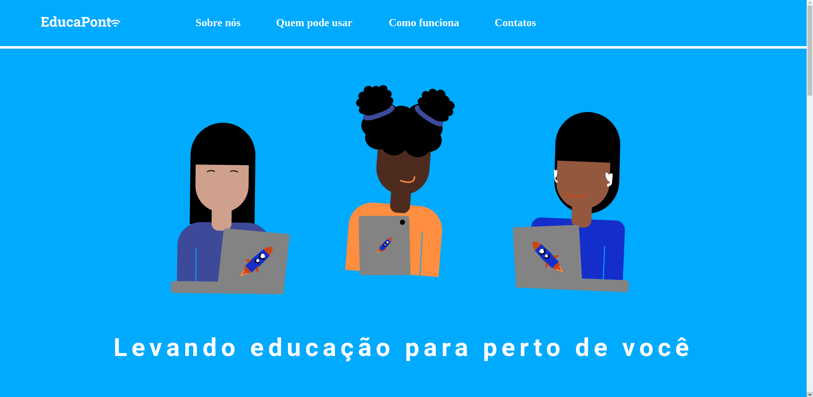
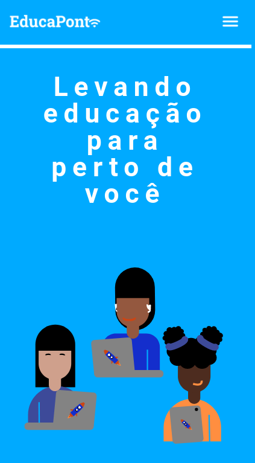

#  EducaPonto
### <b>Levando educação para perto de você</b>

 

### ℹ️ Sobre
Projeto executado durante o evento DoWhile2021 realizado pela Rocketseat 🚀 com o intuito de propor uma solução para a seguinte questão:
> "Pensando em construir o futuro, como você solucionaria os problemas de acesso à educação hoje, utilizando a tecnologia?"

 

### 🖌️ Protótipo

[Figma](https://www.figma.com/file/wYPAdHVIPR0CuVYYuFDV2B/EducaPonto)

 

### 🎨 Layout
<ul>
  <li> <h3> Desktop </h3> </li>
  
  <li> <h3> Mobile </h3> </li>
  
</ul>

 

### 👩🏻‍💻 Autora
 
 <b>Julia Gois</b>

Feito com 💜 por Julia Gois ✨

 

